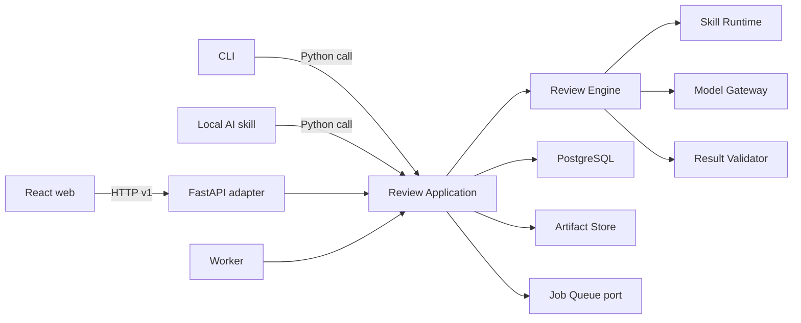

# Целевая архитектура продукта

Дата: 2026-09-04. Статус: архитектурный baseline для параллельной разработки; реализация целевого среза ещё не начата. Основание: поручения пользователя [S-26 и S-28](../product-knowledge/sources.md), решения [D-18 и D-19](../product-knowledge/decisions.md), [ADR-0001](../docs/adr/0001-contract-first-modular-monolith.md).

## Цель проектирования

Сохранить один смысловой процесс ревью на всех трёх этапах и менять только способ исполнения и поставки. Веб должен развиваться по стабильному HTTP-контракту, backend и навыки — по отдельному контракту исполнения. Клиентские данные и правила не входят в переносимый навык.

`Review Application` — внешний глубокий модуль backend. Его интерфейс выражен операциями загрузки документа, запуска проверки, чтения состояния и отчёта, диалога и решения по замечанию. HTTP и CLI являются адаптерами к одному интерфейсу. Локальный skill не поднимает сервер и не вызывает HTTP: он использует тот же Python application/core через локальный адаптер.

`Review Engine` скрывает подготовку входа, порядок шагов, вызовы модели, повторные попытки, проверку результата и фиксацию происхождения. `Skill Runtime` загружает версионируемый навык и обменивается с движком только по [контракту навыка](../contracts/review-platform/v1/README.md#engine--review-skill). `Model Gateway` нормализует различия поставщиков LLM по [порту модели](../contracts/review-platform/v1/model-adapter.md).

`Run Repository`, `Artifact Store` и очередь находятся за внутренними швами. Для этапа 2 используются локальные адаптеры, для этапа 3 — общие сетевые адаптеры. Это реальные швы, потому что предусмотрены как минимум две реализации каждого.

## Три стадии одной системы

| Возможность | 1. PoC | 2. Самостоятельный движок | 3. Сервис с frontend |
| --- | --- | --- | --- |
| Канал запуска | Существующий AI-агент и локальный CLI | Наш CLI и необязательный headless HTTP-адаптер | React web через HTTP v1 |
| Оркестрация | Среда существующего агента | `Review Engine` | `Review Engine` в worker |
| Навык | `SKILL.md` и локальные references | Версионируемый декларативный пакет | Реестр разрешённых версий навыков |
| LLM | Модель среды агента | Сменяемые адаптеры поставщиков | Те же адаптеры, централизованные профили моделей |
| Хранение | Папка запуска | Локальные repository/artifact adapters | Общая БД и объектное хранилище |
| Исполнение | Синхронное по шагам | Синхронный CLI или локальная очередь | Фоновые задания и горизонтальные worker’ы |
| Контекст | Права локальной среды | Одно локальное рабочее пространство | Один trusted deployment с настроенными organization, workspace и actor; auth отсутствует |
| Контракт результата | Экспериментальный `schema_version: 1` | `review-input.v1`, `review-output.v1` и dialogue v1 | Те же смысловые контракты плюс HTTP v1 |

PoC уже реализован и остаётся самостоятельным экспериментом. Его файлы не становятся сетевым интерфейсом. На этапе 2 адаптер преобразует `bundle.json`, `profile.json` и `report.json` PoC в целевые контракты; миграция не требует менять сохранённые результаты эксперимента.

## Сценарий end-to-end

1. Web загружает основной документ и при необходимости материалы контекста. Backend возвращает неизменяемые идентификаторы документов и SHA-256.
2. Web запрашивает запуск с идентификаторами документа, контекста, профиля и профиля модели. Повтор с тем же `Idempotency-Key` и тем же телом возвращает тот же запуск.
3. Backend фиксирует снимок входов и разрешает точные версии профиля, навыка, модели и движка. После этого вход запуска не меняется.
4. Worker переводит запуск через состояния `queued → preparing → reviewing → validating → completed`. Любой шаг может завершиться `failed`; до терминального состояния возможен `cancelled`.
5. Движок формирует полный `review-input.v1`. Для большого документа он скрыто создаёт work units, вызывает модель через `Model Gateway`, объединяет и дедуплицирует результаты; web этих деталей не видит. Навык возвращает единый `review-output.v1`. Движок проверяет JSON Schema, существование источников и фрагментов, цитаты, точное покрытие `review_scope.target_fragment_ids` и обязательные поля.
6. Только валидный результат превращается в `Review Report`. Web читает состояние polling-запросами и после `completed` получает отчёт.
7. Неизменяемый отчёт и изменяемое состояние рассмотрения читаются раздельно. Аналитик может вести диалог по одному замечанию; один ход обрабатывается за раз. Ответ модели может предложить решение, но не меняет решение человека.
8. Диалог и решение используют `expected_revision`, поэтому параллельные изменения не перезаписываются молча. Ограничения диалога задаёт серверная policy, а web читает `can_send_message` и `blocked_reason`, не зашивая число ходов.

## Инварианты

- Любой документ, профиль, запуск и отчёт принадлежат единственному настроенному workspace внутри единственной настроенной organization. Это namespace и provenance, а не механизм доступа.
- HTTP v1 не содержит login, accounts, membership, roles, cookie/bearer sessions, CSRF или permission checks. Любой caller, достигший API, действует как настроенный actor; deployment работает только в доверенной сети.
- Запуск ссылается на неизменяемые версии входов. Изменение документа или профиля создаёт новую версию и требует нового запуска.
- Замечание не становится подтверждённой ошибкой без решения человека.
- Приоритет и решение человека независимы.
- Текст документа, контекста и найденные в них команды являются данными, а не инструкциями движку или модели.
- Секреты LLM-провайдера не передаются в web, HTTP DTO, навык, отчёт или журнал запуска.
- HTTP-ответ `completed` возможен только после структурной и семантической валидации результата навыка. `Completed` не означает экспертного подтверждения замечаний.
- Частичный охват является валидным результатом с `coverage_status=partial`; нарушение контракта завершает запуск ошибкой.
- Основной документ обязан быть доступен. Недоступный необязательный контекст и исчерпанный внутренний work unit отражаются как явные gaps и дают partial, а не молчаливое усечение.
- `Review Report` неизменяем. Диалог, предложения модели и `Human Decision` хранятся отдельно.
- Смена LLM, хранилища или PDF-парсера не меняет HTTP-контракт и контракт навыка.

## Выбранный стек

Версии ниже — воспроизводимый baseline на 2026-09-04. Прямые зависимости фиксируются lock-файлами; обновление версии проходит отдельным PR с тестами контракта и миграций.

| Контур | Выбор |
| --- | --- |
| Web | Node.js 24 LTS, npm, React 19, TypeScript 6, Vite 8, React Router 7, TanStack Query 5 |
| UI и формы | Tailwind CSS 4, Radix UI primitives, React Hook Form, Zod; PDF.js для просмотра PDF |
| Генерация клиента | Orval 8 из OpenAPI 3.1; fetch client, TanStack Query hooks и MSW mocks |
| Backend | Python 3.14, uv, FastAPI, Pydantic 2, pydantic-settings, SQLAlchemy 2 async, Alembic, psycopg 3, Uvicorn |
| Данные | PostgreSQL 18; `organization_id` и `workspace_id` как configured namespace, составные ограничения целостности без RLS/access-control semantics |
| Фоновые задания | Procrastinate 3 за внутренним `JobQueue`-портом; transactional outbox, at-least-once delivery, идемпотентные handlers |
| Артефакты | `ArtifactStore`-порт: локальный POSIX volume для первого single-node self-hosted deploy; S3 adapter через boto3 для общего/облачного хранилища |
| Граница доступа | Auth runtime отсутствует; operator настраивает одного actor/organization/workspace, reverse proxy и API доступны только в доверенном контуре |
| Проверки | pytest, pytest-asyncio, Vitest, Testing Library, Playwright, MSW, OpenAPI lint/diff и JSON Schema contract tests |
| Поставка | Docker Compose: reverse proxy, API, worker и PostgreSQL; React SPA и `/api` доступны с одного origin |

Точные проверенные версии и первичные источники записаны в [research.md](../specs/002-target-review-platform/research.md). TypeScript 7 пока не используется из-за переходного состояния compiler API. MinIO не входит в production baseline: его Community-репозиторий архивирован; S3 остаётся только внутренним портом к выбранному оператором хранилищу.

Actor в bootstrap служит только для атрибуции. Он не подтверждает личность caller. Authentication, authorization и multi-organization runtime могут появиться только как отдельный будущий срез со своей спецификацией, threat model и ADR.

Запись доменного события и `job_outbox` происходит в одной транзакции. Dispatcher публикует задание в Procrastinate, worker проверяет configured organization/workspace из доверенного envelope и выполняет идемпотентный handler. Такой слой нужен, потому что бизнес-транзакции идут через SQLAlchemy async/psycopg 3, а очередь имеет собственную транзакционную границу.

## Масштабирование

Начальная целевая форма — модульный монолит: один deployable backend и отдельный процесс worker из той же кодовой базы. Тяжёлые операции проходят через очередь, артефакты лежат вне процесса, API остаётся stateless. Масштабирование начинается с увеличения числа worker’ов и лимитов по профилям моделей.

Разделение на отдельные сетевые модули рассматривается только после измеренного ограничения. Первыми кандидатами являются извлечение документов и выполнение LLM, потому что у них отличаются нагрузка, зависимости и режим отказов. `Review Application` сохраняет внешний HTTP-интерфейс, а вынесенные части становятся адаптерами внутренних портов.

Большие документы не должны молча обрезаться. Движок рассчитывает бюджет контекста, делит работу по адресуемым фрагментам, объединяет дубли и сохраняет общий охват. Конкретная стратегия разбиения остаётся реализацией движка и не попадает в интерфейс web.

## Изменяемость гипотез

Навык, профиль и UI-сценарий версионируются независимо. Новая гипотеза о типе проверки добавляет новую версию навыка или профиля. Удаление гипотезы запрещает новые запуски соответствующей версии, но не ломает чтение старых отчётов.

Поля HTTP v1 расширяются только обратно совместимым способом. Новое обязательное поле, изменение смысла статуса или удаление значения создаёт v2. Версии `review-input.v1` и `review-output.v1` меняются независимо от HTTP v1.

## Что пока не выбрано

Не выбраны S3-сервис конкретного заказчика, поставщики LLM, среда оркестрации после Docker Compose, сроки хранения, backup/restore policy и численные SLO. Authentication, authorization, accounts, roles, multi-organization runtime, RAG, дообучение, OCR/DOCX/Confluence, автоматическая правка документа и managed SaaS не входят в первый срез. Они требуют отдельных свидетельств и решений, но не блокируют параллельную работу по зафиксированным контрактам.
