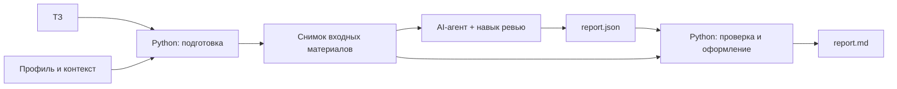

# PoC: ревью ТЗ через переносимый навык

Дата: 2026-09-03. Статус: план proof of concept; реализация навыка ещё не начата. Основание: обсуждение и поручения пользователя [S-20](../../knowledge/sources.md), решение [D-10](../../knowledge/decisions.md).

## Назначение и границы

Проверить техническую осуществимость полного сценария: AI-агент читает готовое ТЗ и контекст проекта, формирует адресные замечания, а локальные скрипты проверяют структуру результата и привязки к источникам.

Пользователь переименовал обсуждавшийся MVP в PoC. Этот план фиксирует выбранную экспериментальную конфигурацию. Общий [таймлайн и workflow](../../knowledge/roadmap.md) ведётся отдельно: этапы после PoC находятся в статусе `planning` и могут меняться при добавлении, уточнении или исключении гипотез.

### Выбранный состав

Нумерация относится к [основному реестру гипотез](../../knowledge/hypotheses-v2.md).

| Пункт | Что входит в PoC |
| --- | --- |
| 1.1 | Однократное ревью готового ТЗ |
| 2.1 | Переносимый навык для AI-агентов с доступом к файлам и запуском локальных скриптов |
| 3.1–3.2 | Сохраняемый профиль, шаблон документа и явно подключённые материалы проекта |
| 4.1 | Адресные замечания: фрагмент, проблема, причина, вопрос и статус рассмотрения |
| 4.2 | Приоритет с объяснением; весь список остаётся доступным |

Разделы 3.1–3.2 ещё содержат редакционные пометки. Для PoC согласован их общий минимум: профиль и контекст, без библиотеки прошлых ошибок 3.3.

За пределами PoC: веб-интерфейс 2.2, диалог-допрос 1.2, новая версия ТЗ 4.3, библиотека 3.3, RAG, собственный сервер моделей, централизованные аккаунты и хранение. Эти варианты сохраняются в реестре для дальнейшего рассмотрения.

Выбран способ поставки «навык со скриптами». Модель и инструменты предоставляет среда агента. Формулировка «для любой LLM» означает независимость логики ревью от провайдера, а не подтверждённую совместимость с каждой моделью или обычным чатом.

### Предлагаемые технические значения по умолчанию

- Формат упаковки: Agent Skills, рабочее имя навыка `review-data-spec`.
- Вход: одно готовое ТЗ в PDF с текстовым слоем, Markdown или TXT; дополнительные файлы контекста подключаются явно.
- Язык результата: русский. Среда: Python 3.11+, чтение и запись файлов, запуск команд.
- Отчёты сохраняются локально. OCR, DOCX и автоматическое скачивание связанных страниц в первую версию не входят.
- Эти детали происходят из предложенного плана; отдельная проверка совместимости и удобства ещё не проведена.

## Устройство PoC

Агент выполняет смысловое ревью. Python готовит документы, фиксирует источники, проверяет структуру и цитаты, формирует читаемый отчёт. Совпадение цитаты с извлечённым текстом не доказывает правильность вывода агента или точность самого извлечения.

Предлагаемый интерфейс локального помощника: операции `prepare`, `validate`, `render`. Форматы подготовленных материалов и отчёта получают `schema_version: 1`. Каждый запуск имеет собственную папку со снимком входа, настройками и результатами; повторный запуск не перезаписывает предыдущий.

Подготовленные материалы содержат текстовые блоки и таблицы, идентификаторы фрагментов, страницы PDF или строки текстового файла. Манифест фиксирует хеши исходников, версию навыка и обработчика, выбранный профиль и настройки. Модель и её версию записываем, если среда сообщает их достоверно; иначе указываем «неизвестно».

### Выбор обработчика PDF

В первоначальном плане предложен pdfplumber. После предложения пользователя Docling рассматривается как кандидат на основной обработчик. Окончательный выбор открыт до практического сравнения.

По поручению пользователя создана отдельная задача «Сравнение Docling и pdfplumber на PDF MTS». Ей передано сравнение текста, структуры таблиц, имён полей, порядка чтения, привязок, времени, памяти и сложности локальной установки. Результаты этой задачи в настоящем плане ещё не учтены; преимущество одного инструмента не установлено.

Вне зависимости от выбора навыку передаётся наше представление фрагментов и источников. Исходный структурированный результат обработчика сохраняется рядом для диагностики. Это позволяет заменить обработчик, сохраняя смысловой сценарий ревью. Замена версии обработчика требует проверки привязок; их стабильность между версиями не предполагается.

## План реализации

### Slice 1: Подготовка документов и источников

**Цель:** получить читаемый документ с проверяемыми привязками к оригиналу.

**Включаем:** учёт результата сравнения обработчиков; локальное извлечение; единое представление текста и таблиц; снимок исходников и манифест; диагностику повреждённых файлов, пустых страниц и неполного извлечения. Нормализованный текст хранится с возможностью сверки с оригиналом.

**Не включаем:** смысловое ревью, OCR, DOCX, автоматическую загрузку связанных страниц.

**Проверка:** текст, таблицы, переносы в ячейках, повторяющиеся фрагменты, пустой и повреждённый PDF; воспроизводимость адресации при неизменном входе и конфигурации. Проверить сохранность содержимого по оригиналам.

**Контрольная точка:** выбран обработчик с зафиксированным основанием; известные потери обозначены; исходные фрагменты можно найти по привязкам.

### Slice 2: Однократное ревью и адресный отчёт

**Цель:** реализовать сценарий 1.1 + 2.1 + 4.1 с базовыми инструкциями проверки.

**Включаем:** `SKILL.md`, необходимые справочные материалы и скрипты; проверку требований внутри разделов и связей между ними; объединение дублей; `report.json` и создаваемый из него `report.md`.

Каждое замечание содержит ID, фрагмент, проблему, причину, уточняющий вопрос и статус «не рассмотрено». Скрипт проверяет структуру отчёта, существование источников и цитаты. Для отсутствующего требования указывается проверенная область документа, а не выдуманная цитата. Отчёт отражает непрочитанные материалы и неполноту проверки. Исходное ТЗ остаётся неизменным; окончательное решение принимает человек.

**Не включаем:** профиль клиента, приоритеты, диалог-допрос и автоматическое исправление ТЗ.

**Проверка:** синтетические документы с противоречием между разделами, отсутствующим требованием и корректным описанием; отклонение выдуманных цитат и неверных источников. Отдельно проверить, что инструкции внутри ТЗ не управляют агентом.

**Контрольная точка:** полный сценарий проходит в чистой рабочей папке; отчёт содержит проверенные привязки и явно обозначенный охват.

### Slice 3: Профиль проекта и приоритеты

**Цель:** добавить минимум 3.1–3.2 и приоритизацию 4.2.

**Включаем:** редактируемый `profile.json` с названием, версией, ролью, целью, направлениями проверки и перечнем файлов контекста. У материалов фиксируются источники и версии либо хеши. Предусмотреть базовый профиль ТЗ на данные и отдельный черновой профиль MTS. Противоречивые правила показывать как неопределённость. Без выбранного профиля применять базовый с отметкой в отчёте.

Предложенная шкала: высокий приоритет — риск неверных данных или существенного выбора реализации; средний — значимое уточнение отдельного сценария; низкий — локальная неточность с ограниченными последствиями. Каждый приоритет сопровождается объяснением. Шкала ещё не откалибрована экспертами. Приоритет и подтверждение человеком хранятся отдельно; сортировка сохраняет весь список.

**Не включаем:** библиотеку прошлых ошибок, RAG и автоматическое обучение на обратной связи.

**Проверка:** одинаковое ТЗ с базовым и клиентским профилем; недоступный контекст; конфликт правил; независимые профили без смешивания материалов; сохранность всех замечаний после сортировки.

**Контрольная точка:** клиентские основания прослеживаются до источников, а профиль и контекст отделены от переносимого навыка.

### Slice 4: Установка и проверка PoC

**Цель:** подготовить навык к самостоятельному запуску и экспертной оценке.

**Включаем:** переносимую папку навыка, зафиксированные зависимости, инструкцию установки; проверку из копии без доступа к базе разработчиков; реальный прогон в доступном агенте; перечень проверенных сред; протокол оценки замечаний и затрат времени.

**Не включаем:** публикацию в маркетплейсе и заявление об одинаковом качестве во всех моделях.

**Проверка:** структура навыка, установка зависимостей, полный сценарий на новом синтетическом документе, неизменность исходников, ссылки документации и симлинк `CLAUDE.md`.

**Контрольная точка:** навык устанавливается и выдаёт проверяемый отчёт; фактически проверенные среды отделены от предполагаемо совместимых. Экспертная оценка проводится отдельно от проверки файлов и скриптов.

## Связь с дальнейшим развитием

- Профили, сценарии ревью и формат доставки могут меняться по результатам проверки гипотез. Состав PoC не делает их обязательными частями будущего продукта.
- Фрагмент документа, источник и результат запуска — кандидаты на общие понятия. Их роль в общей архитектуре ещё обсуждается; нынешняя схема данных не объявляется постоянным публичным контрактом продукта.
- Большие документы потребуют проверки полноты чтения и межраздельных связей. Неполный анализ явно обозначается; автоматическое распределённое ревью в PoC не планируется.
- При появлении веб-интерфейса или общего сервиса понадобятся отдельные решения об исполнении, моделях, хранении и доступах. Локальные папки PoC не обеспечивают многопользовательскую изоляцию.

## Размещение материалов и критерии

`implementation/poc/` содержит план и будущую общую реализацию PoC. Общие продуктовые знания остаются в [knowledge](../../README.md#общая-база). Исходники, профили, результаты и протоколы MTS хранятся внутри [MTS](../../MTS/README.md); в переносимую папку навыка они не включаются. Универсальные тестовые примеры должны быть синтетическими.

Технические критерии описаны в контрольных точках. Для экспертной оценки фиксируем полезность, пропуски, дубли, обоснованность приоритета и время аналитика по [плану проверки](../../knowledge/discovery-plan.md). Численные пороги, выборка, сроки и ответственные ещё не согласованы.

Известные примеры MTS подходят для разработки и демонстрации. После использования при настройке они не являются независимым контрольным набором. Работоспособность PoC не подтверждает экономию, регулярное использование, спрос или переносимость на другие компании; статусы продуктовых гипотез сохраняются.
