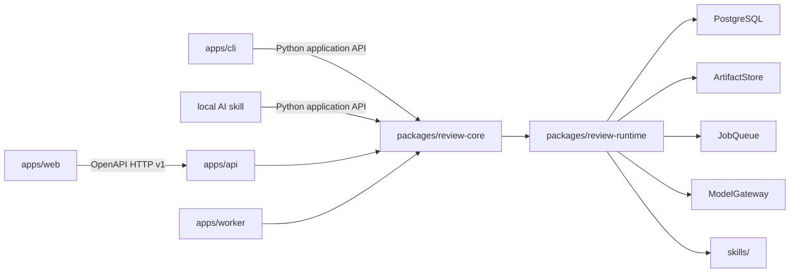

# Implementation Plan: Целевая платформа предварительного ревью ТЗ

**Branch**: `codex/002-target-review-platform` | **Date**: 2026-09-04 | **Spec**: [spec.md](spec.md)

**Input**: единый целевой продукт для трёх стадий; React web и backend/skills разрабатываются параллельно по стабильным контрактам.

## Summary

Построить первый целевой вертикальный срез: загрузка готового ТЗ и контекста, фоновое ревью, неизменяемый адресный отчёт, последовательный диалог по замечанию и отдельное решение человека. Реализация — contract-first модульный монолит. React SPA вызывает FastAPI по HTTP v1; локальный skill и CLI вызывают то же Python application/core напрямую. API и worker разделены на процессы, PostgreSQL хранит состояние и outbox, артефакты находятся за `ArtifactStore`.

Этот план и `tasks.md` разрешают начало реализации только после явного поручения пользователя. Текущий результат — дизайн и готовый к ветвлению baseline.

## Technical Context

**Language/Version**: Python 3.14.7; TypeScript 6.0.3; Node.js 24.20.0 LTS

**Primary Dependencies**: FastAPI 0.141.1, Pydantic 2.13.5, SQLAlchemy 2.0.52, psycopg 3.3.5, Procrastinate 3.9.0; React 19.2.8, Vite 8.2.2, React Router 7.18.3, TanStack Query 5.102.8, Orval 8.28.1, MSW 2.15.0

**Storage**: PostgreSQL 18.6; durable POSIX volume through `ArtifactStore` for initial single-node deployment; optional S3 adapter through boto3 1.43.88

**Testing**: pytest/pytest-asyncio and PostgreSQL integration tests; JSON Schema/OpenAPI contract tests; Vitest/Testing Library; Playwright E2E; MSW mock mode; PoC regression suite

**Target Platform**: self-hosted Linux containers; modern evergreen desktop browsers; local macOS/Linux CLI and AI-agent environment

**Project Type**: Python modular monolith with API/worker/CLI composition roots plus independent React SPA

**Performance Goals**: no evidence-backed SLO yet. The API remains responsive by making review/dialogue generation asynchronous; large documents are processed without silent truncation. Numeric latency, throughput and concurrency targets must come from pilot constraints.

**Constraints**: one primary document; PDF with text layer, Markdown or UTF-8 TXT; up to 50 optional context sources in HTTP v1; polling baseline; self-hosted operation without vendor cloud; exactly one configured organization/workspace/actor and no auth runtime; trusted network only; immutable inputs/reports; no provider secrets or MTS data in public contracts/fixtures

**Scale/Scope**: first target slice and one deployable system for one configured organization/workspace; actual document sizes, concurrent runs, retention and SLO remain unknown until pilot discovery

## Constitution Check

*GATE before research and re-checked after design: PASS.*

- Общие и MTS-specific материалы разделены: новые архитектурные и контрактные файлы общие, MTS fixtures не копируются.
- Факт, предложение, решение и гипотеза различены: стек и контракт — D-18/ADR; продуктовые эффекты остаются неподтверждёнными.
- Источники текущего поручения и внешней технической проверки зарегистрированы; версии и ограничения приведены в `research.md`.
- Численные продуктовые цели не выдуманы. Числа в HTTP/schema — предлагаемые технические пределы первого среза, а не доказанный порог ценности.
- PoC и его MTS run сохраняются; целевая система использует adapter и не переписывает исходные артефакты.
- `AGENTS.md` остаётся единственным источником инструкций; `CLAUDE.md` проверяется как относительный symlink.
- Реализация не начинается этим планом: репозиторий получает только спецификацию, дизайн, контракты и задачи.

## Architecture and Module Boundaries



`review-core` exposes coarse use cases rather than repositories: prepare document, create/cancel run, execute run, read immutable report, read/add dialogue turn, put human decision. Ports do not leak provider SDKs or transport DTO. Runtime adapters implement Postgres, POSIX/S3, Procrastinate, parser, model and skill loading. API/worker/CLI only compose and translate.

## State Machines

Review run:

```text
queued -> preparing -> reviewing -> validating -> completed
   |          |            |            |
   +----------+------------+------------+-> failed
   +----------+------------+------------+-> cancelled (when accepted)
```

Dialogue turn:

```text
queued -> generating -> completed
   |          |
   +----------+-> failed -> retry creates a new generation attempt for the same member message
```

Only one dialogue turn per finding may be `queued|generating`. `can_send_message` and `blocked_reason` are server projections from state and the immutable policy snapshot. The model cannot mutate `HumanDecision`.

## Project Structure

### Documentation

```text
specs/002-target-review-platform/
├── spec.md
├── plan.md
├── research.md
├── data-model.md
├── quickstart.md
├── contracts/README.md
├── checklists/requirements.md
└── tasks.md

architecture/
├── target-product.md
└── parallel-development.md

contracts/review-platform/v1/
├── openapi.yaml
├── deployment-boundary.md
├── model-adapter.md
├── schemas/
└── examples/
```

### Target Source Layout

```text
pyproject.toml
uv.lock
apps/
├── api/src/review_api/                # FastAPI composition root and HTTP DTO mapping
├── worker/src/review_worker/          # queue handlers and outbox dispatcher
├── cli/src/review_cli/                # local/headless adapter without HTTP
└── web/                                # React SPA, generated client, MSW, UI tests
packages/
├── review-core/src/review_core/       # domain, application services and ports
└── review-runtime/src/review_runtime/ # Postgres/storage/model/parser/skill/queue adapters
skills/
└── review-data-spec/                  # versioned portable instructions and references
contracts/
└── review-platform/v1/                # canonical public and skill contracts
deploy/
└── compose/                           # reverse proxy, API, worker, PostgreSQL
tests/
├── contract/
├── integration/
├── e2e/
└── security/
implementation/poc/                    # preserved feature 001 and compatibility adapter fixture
```

**Structure Decision**: web owns only `apps/web`; backend/skills own every Python composition root, `packages/`, `skills/` and deploy files. `contracts/` is jointly reviewed. This prevents routine file conflicts while keeping one repository and one integration baseline.

## Data and Transaction Boundaries

- A `ReviewRun` stores immutable IDs/digests for document, context, profile, skill, model profile, engine and dialogue policy.
- `ReviewReport` and `Finding` are append-once. `HumanDecision`, `FindingDialogue` and generation attempts are separate mutable/versioned records.
- API verifies that path resources belong to the configured workspace namespace, performs the use case and writes outbox atomically in one transaction.
- Worker reads organization/workspace IDs from the trusted job envelope, verifies them against deployment configuration, then executes an idempotent handler.
- Artifact upload writes to a staging key, verifies size/hash, records metadata, then atomically promotes; failed transactions leave collectable orphan staging objects, never referenced final objects.

## Contract Decisions

- Canonical web contract: [root OpenAPI v1](../../contracts/review-platform/v1/openapi.yaml).
- Canonical skill contracts: review input/output, finding-dialogue input/output and skill manifest under `contracts/review-platform/v1/schemas/`.
- Web gets no `review_skill_id`; backend resolves an allowed exact skill version and records it in `execution_snapshot`.
- Report bytes/ETag do not change after dialogue or decisions. Web reads mutable `finding-states` separately.
- Large-document work units are internal. `review_scope.target_fragment_ids` defines the only coverage partition; context fragments are supporting evidence.
- Primary source unavailable means failed run. Optional context partial/unavailable means a valid partial report with source-level gaps.
- [Deployment boundary](../../contracts/review-platform/v1/deployment-boundary.md) explicitly excludes authentication and authorization: every HTTP caller acts as the configured actor, so the service is restricted to a trusted network.

## Delivery Slices

1. **Contract harness**: schemas, generated web client/MSW, backend contract skeleton and synthetic fixtures.
2. **Tracer bullet**: bootstrap → upload → create/poll run → immutable fixture report → finding states → one dialogue turn → decision.
3. **Real core**: PoC adapter, parser, skill runtime, deterministic model fake, semantic validator; same HTTP response.
4. **Persistence**: PostgreSQL constraints, configured-workspace namespace, artifact store, outbox/worker and restart tests.
5. **Real model and self-hosted package**: OpenAI-compatible adapter, trusted-network Compose, operations and full E2E.

The first two slices are deliberately shared foundations; after their contract generation is green, web work and backend/core work proceed in parallel as described in [parallel-development.md](../../architecture/parallel-development.md).

## Complexity Tracking

| Decision | Why needed | Simpler alternative rejected because |
| --- | --- | --- |
| API and worker as separate processes | LLM/document work is long-running and cancellable | synchronous request would tie browser/API lifetime to model execution |
| Organization/workspace IDs retained in records | keeps a future migration seam without claiming current isolation | removing the namespace would make later migration harder and weaken provenance |
| Transactional outbox before Procrastinate | business state and enqueue cross transaction boundaries | direct dual-write can persist a run without a job or enqueue without its state |
| Separate immutable report and mutable finding state | auditability and reproducibility | embedding decisions in report silently mutates model output and invalidates ETag/provenance |
| Two language-neutral contract families | web and skills have different consumers/lifecycles | one giant DTO couples HTTP presentation to local engine execution |

No authentication, authorization, accounts, roles, multi-organization runtime, microservices, Redis, Kubernetes, RAG, vector database, OCR pipeline or managed cloud control plane are introduced in this slice.
