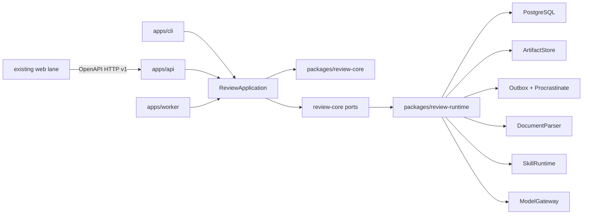

# Implementation Plan: Рабочий backend платформы ревью

**Branch**: `codex/003-backend-implementation` | **Date**: 2026-09-05 | **Spec**: [spec.md](spec.md)

**Input**: новая backend-only спецификация feature 003 поверх принятого target/contract baseline feature 002. Реализация выполняется отдельной Codex-задачей; web lane не входит в эту ветку.

## Summary

Реализовать backend первого целевого среза как contract-first модульный Python-монолит с тремя composition roots: FastAPI API, background worker и direct CLI. Независимое `review-core` владеет use cases, state machines и validators; `review-runtime` предоставляет PostgreSQL, POSIX, pdfplumber, declarative skill, job queue и model adapters. PostgreSQL хранит доменное состояние и transactional outbox, Procrastinate доставляет at-least-once jobs, immutable bytes находятся за provider-neutral `ArtifactStore`.

Обязательный release проходит целиком на deterministic adapter и synthetic fixtures без ключей и оплаты. Fixture expected findings выбираются trusted digest/config, а не content markers; любой другой документ получает честный zero-finding partial report с per-fragment `CoverageGap(code=other, reason=semantic_analysis_not_performed)`. Это не заранее сохранённый HTTP-report: используются реальные upload, extraction, orchestration, schema/semantic validation, canonical publication, dialogue и persistence. Deterministic composition соединяется только с declared internal PostgreSQL/queue services и делает 0 external/unknown destination attempts. Реальный OpenAI-compatible endpoint, включая уже доступную бесплатную локальную модель, остаётся необязательным explicit-egress adapter smoke и не блокирует Definition of Done.

## Technical Context

**Language/Version**: Python 3.14.7; точная версия фиксируется `.python-version` и container image

**Primary Dependencies**: uv 0.12.9; FastAPI 0.141.1; Pydantic 2.13.5; pydantic-settings 2.15.0; SQLAlchemy 2.0.52 async; Alembic 1.19.1; psycopg 3.3.5; Procrastinate 3.9.0; Uvicorn 0.52.4; pdfplumber 0.11.10; `rfc8785==0.1.4`; JSON Schema Draft 2020-12 validator; HTTP client для optional OpenAI-compatible adapter

**Storage**: PostgreSQL 18.6 как source of truth; durable POSIX volume для обязательной single-node поставки; `ArtifactStore` сохраняет future portability, но S3 implementation в feature 003 не входит

**Testing**: pytest, pytest-asyncio, HTTP ASGI tests, PostgreSQL integration/migration tests, JSON Schema/OpenAPI validation, official RFC 8785 Appendix B + `cyberphone/json-canonicalization` vectors, security/log capture tests, Docker Compose smoke/restart E2E, неизменённый PoC regression suite

**Target Platform**: self-hosted Linux containers; локальный macOS/Linux CLI; default internal Compose service network and loopback/configured trusted proxy bind. Optional model endpoint получает отдельный opt-in egress allowlist; OS-wide host firewall не входит в feature

**Project Type**: backend modular monolith с API/worker/CLI composition roots и двумя workspace packages

**Performance Goals**: подтверждённого SLO нет. HTTP не ждёт document/model work и остаётся доступным через asynchronous state/polling; ни один fragment не теряется из-за budget silently. Численные throughput/concurrency/latency targets откладываются до pilot constraints.

**Constraints**: один configured organization/workspace/actor; no auth runtime; один primary document; PDF text layer, Markdown, UTF-8 TXT; до 50 context documents по HTTP v1; immutable inputs/reports; exact coverage; deterministic external-egress deny gate with declared internal service allowlist; provider secrets и MTS/client data запрещены в public artifacts/logs. Canonical purpose-built document/report/dialogue responses могут содержать только предусмотренные contract content fields; content запрещён в metadata/errors/queue/logs/metrics/diagnostics

**Scale/Scope**: один single-node deployment первого среза. Production retention, backup/RPO/RTO, HA/Kubernetes, фактические размеры документов и число параллельных runs не установлены и не маскируются произвольными defaults.

## Constitution Check

*GATE before research: PASS. Re-check after design: PASS.*

- `AGENTS.md` прочитан и остаётся единственным нормативным источником общих правил; `.specify/memory/constitution.md` используется только как указатель. Любая незамерженная альтернативная constitution non-normative и не может менять scope/gates.
- Поручение пользователя отдельно разрешает реализацию, поэтому D-02 больше не блокирует feature 003; D-18/D-19 и ADR-0001 остаются действующими.
- Feature 003 новый: feature 001 сохраняет PoC/эксперимент, feature 002 сохраняет target architecture и contract baseline. Ни один из них не превращается в implementation progress log.
- Общие fixtures и skill package синтетические; MTS используется только как evidence для edge cases и не копируется за пределы `MTS/`.
- Технические defaults отличены от фактов и продуктовых результатов. Deterministic adapter доказывает workflow, а не полезность review; optional local-model smoke не доказывает качество модели.
- Нет выдуманных SLO, ROI, accuracy или пилотных результатов. Нерешённые production parameters сохранены явно.
- Исходные PoC/MTS artifacts не изменяются; adapter read-only и проверяется hashes/regression suite.
- `CLAUDE.md` остаётся относительным symlink на `AGENTS.md`; implementation tasks включают integrity gate.

## Baseline and Change Boundary

Canonical input baseline:

- [feature 002](../002-target-review-platform/spec.md) — общая продуктовая семантика;
- tag `review-platform-contract-v1.0.1` и [root contracts](../../contracts/review-platform/v1/README.md) — web/skill machine boundary;
- [target architecture](../../architecture/target-product.md) и [ADR-0001](../../docs/adr/0001-contract-first-modular-monolith.md) — module/deployment decisions;
- [feature 001 PoC](../001-review-data-spec-poc/spec.md) — compatibility source, не reusable public API.

До зависимой реализации выполняется additive contract preflight `v1.0.2`: OpenAPI `info.version`; missing `400` invalid-cursor responses для document/run lists; missing `404` upload response; `409` profile-version conflicts; полный существующий `400/404/409` conformance set; уточняющие descriptions profile/extraction/canonical ETag; локальная production API documentation. Root README/CHANGELOG, affected examples/tests и tag `review-platform-contract-v1.0.2` выпускаются вместе; FastAPI export, прежние examples и генерация/typecheck через отдельный backend-owned harness `tools/contracts/orval/` с exact Node/npm/TypeScript/Orval pins доказывают compatibility, не читая и не меняя `apps/web/`. Это изменение выпускается из feature 003 как отдельный contract commit/PR и не редактирует артефакты `specs/002-*`. Любое найденное breaking изменение останавливает только зависимый contract task и требует `/v2`; оно не маскируется в `v1`.

## Architecture and Deep Module Boundaries



### `review-core`

Framework-independent deep module. Exposes coarse commands/queries rather than repositories:

- `get_bootstrap`, `upload/list/get/download_document`;
- `list/create_review_profile` and `list_model_profiles`;
- `create/cancel/execute/get/list_review`;
- `get_report` and `list_finding_states`;
- `get_dialogue` and `create/retry/execute_dialogue_turn`;
- `put_human_decision`;
- `import/read_poc_v1` compatibility use case.

Core owns domain IDs/value objects, state transitions, idempotency semantics, cancellation decisions, exact coverage, anchor/quote validation, report publication rules and dialogue policy projection. It imports neither FastAPI, Pydantic transport DTO, SQLAlchemy, Procrastinate, pdfplumber nor provider SDKs.

Every backend-owned root OpenAPI operationId maps to exactly one coarse application command/query. In particular bootstrap and exact-byte document download do not read config/repositories/ArtifactStore directly from an HTTP route.

### `review-runtime`

Implements ports and provider-specific details:

- SQLAlchemy repositories/UoW and Alembic migrations;
- mandatory POSIX implementation за provider-neutral `ArtifactStore`; S3 implementation deferred;
- pdfplumber/text `DocumentParser`;
- declarative skill loader/executor and PoC v1 reader;
- deterministic and OpenAI-compatible `ModelGateway` adapters;
- outbox dispatcher and Procrastinate `JobQueue` adapter;
- canonical JSON, safe logging/redaction and `runtime-config.v1` JSON Schema/operator configuration helpers;
- exact idempotent seed/check for deployment context, deployment-scoped system profile, deterministic model profile, dialogue policy and skill package;
- explicit Procrastinate schema initialization/version check via locked `uv run --frozen procrastinate --app=<app> schema --apply` followed by locked `... healthchecks`.

### Composition roots

- `apps/api`: Pydantic DTO mapping, RFC 9457 errors, request/trace IDs, route wiring, local docs assets, liveness/readiness.
- `apps/worker`: outbox dispatch, queue handlers, heartbeats/recovery, bounded retries and cooperative cancellation.
- `apps/cli`: direct application composition for contract smoke, local review and PoC read; no HTTP dependency for core operations.

Composition roots may import core and runtime. Runtime implements core ports. Core never imports a composition root or runtime implementation.

## Project Structure

### Documentation (this feature)

```text
specs/003-backend-implementation/
├── spec.md
├── plan.md
├── research.md
├── data-model.md
├── quickstart.md
├── contracts/
│   ├── README.md
│   ├── http-v1-clarifications.md
│   ├── runtime-semantics.md
│   ├── runtime-config.v1.schema.json
│   ├── job-envelope.v1.schema.json
│   ├── canonicalization.md
│   ├── poc-v1-mapping.md
│   ├── poc-import-view.v1.schema.json
│   └── test-matrix.md
├── checklists/requirements.md
└── tasks.md
```

### Target Source Code

```text
pyproject.toml
uv.lock
.python-version
Makefile
apps/
├── api/
│   ├── pyproject.toml
│   └── src/review_api/
│       ├── app.py
│       ├── config.py
│       ├── dependencies.py
│       ├── errors.py
│       ├── middleware.py
│       ├── dto/
│       ├── routes/
│       └── static/docs/
├── worker/
│   ├── pyproject.toml
│   └── src/review_worker/
│       ├── app.py
│       ├── dispatcher.py
│       ├── handlers.py
│       └── recovery.py
├── cli/
│   ├── pyproject.toml
│   └── src/review_cli/
│       ├── main.py
│       └── commands/
└── web/                              # owned elsewhere; untouched by feature 003
packages/
├── review-core/
│   ├── pyproject.toml
│   ├── src/review_core/
│   │   ├── domain/
│   │   ├── application/
│   │   ├── ports/
│   │   ├── review/
│   │   └── dialogue/
│   └── tests/
└── review-runtime/
    ├── pyproject.toml
    ├── src/review_runtime/
    │   ├── artifacts/
    │   ├── canonical/
    │   ├── config/
    │   ├── documents/
    │   ├── fakes/
    │   ├── models/
    │   ├── poc_adapter/
    │   ├── postgres/
    │   ├── queue/
    │   ├── security/
    │   └── skills/
    ├── migrations/
    └── tests/
skills/
└── review-data-spec/
contracts/
└── review-platform/v1/              # canonical boundary; v1.0.2 additive preflight only
deploy/
└── compose/
    ├── compose.yaml
    ├── Dockerfile.api
    ├── Dockerfile.worker
    ├── Dockerfile.cli
    ├── proxy/
    ├── config/
    │   ├── runtime-config.synthetic.v1.json
    │   └── trusted-fixture-output.synthetic.v1.json
    └── env.example
tests/
├── contract/
├── fixtures/synthetic-review/
├── integration/
├── migration/
├── security/
└── e2e/
tools/
└── contracts/
    ├── validate_contracts.py
    └── orval/                         # backend-owned disposable consumer harness
        ├── package.json
        ├── package-lock.json
        ├── tsconfig.json
        └── orval.config.ts
```

**Structure Decision**: сохранить структуру feature 002, но feature 003 владеет только backend/skills/deploy/tests и additive contract preflight. `apps/web/` является внешним consumer lane и включается только в negative diff guard.

## Data and Transaction Boundaries

- PostgreSQL transaction управляется application Unit of Work. Создание run/turn, durable idempotency reservation и соответствующей `job_outbox` записи атомарно; unique reservation обеспечивает one resource/outbox при concurrent same-key/same-body race до проверки mutable projection.
- Original document bytes сначала пишутся в same-filesystem staging, проверяются streaming size/hash и file-fsync. Затем publisher открывает DB transaction, получает transaction-scoped PostgreSQL advisory fencing lock от exact namespace/store-key/digest, выполняет atomic promotion и parent-directory-fsync, создаёт metadata reference и только commit освобождает lock. Collector для promoted orphan берёт тот же lock, повторно проверяет DB reference под lock и удаляет object до release; при недоступной БД deletion пропускается. Поэтому конкурентный collector не может удалить bytes между non-reference check и commit publisher. Crash до/после promotion, но до DB commit, оставляет недоступный staging/promoted orphan, который безопасно очищается после grace period.
- Create run фиксирует requested source identities/order/roles и exact config versions до enqueue. Extraction в `preparing` использует single-writer claim/heartbeat/recovery по `(document_id, parser_name, parser_version, settings_digest)`; concurrent workers reuse terminal result. Append-once prepared-source status, exact fragment IDs/diagnostics фиксируется после extraction и до `reviewing`.
- Immutable profile-version rows никогда не меняют head flag: отдельный mutable family-head pointer обновляется CAS; system default является deployment-scoped release seed, а не workspace-owned version.
- Report graph проходит schema + semantic validation in-memory, сериализуется canonical procedure, пишется как staged immutable artifact и публикуется одной DB transaction вместе с append-only metadata/findings и переходом run в `completed`.
- `FindingState`, dialogue и decisions находятся в отдельных mutable/versioned records; report artifact не перегенерируется.
- Jobs несут только trusted IDs/versions/trace metadata. Document/message text и provider credentials разрешаются worker через repositories/secret provider, а не копируются в queue payload.
- Clean bootstrap валидирует `runtime-config.v1` policy и typed operator deployment settings. Root schema default с пустым binding list остаётся safe no-semantic policy; documented Compose smoke явно монтирует versioned `runtime-config.synthetic.v1.json` и его exact read-only `trusted-fixture-output.synthetic.v1.json`, проверяя resource SHA/schema и все document/profile/skill/parser/engine selectors. One-off locked image commands выполняют `uv run --frozen alembic ... upgrade head`, затем `uv run --frozen procrastinate --app=<app> schema --apply`; bootstrap идемпотентно seeds exact config entities and package digests, а readiness запускает locked `... procrastinate ... healthchecks`. Drift/stale schema/config/resource делает readiness unhealthy вместо auto-mutation.

## State and Race Decisions

Review run:

```text
queued -> preparing -> reviewing -> validating -> completed
   |          |            |            |
   +----------+------------+------------+-> failed
   +----------+------------+------------+-> cancelled
```

Отмена является CAS-решением в той же transaction boundary, что публикация. Если publication wins — run `completed` и cancel получает conflict. Если cancellation wins — `cancelled`, report reference отсутствует, последующая publication rejected. Worker проверяет cancel до каждого bounded stage/work item/model call и прямо перед publication.

Dialogue turn:

```text
queued -> generating -> completed
   |          |
   +----------+-> failed
                    |
                    +-- explicit retry/new GenerationAttempt --> queued
```

Partial unique constraint запрещает более одного active turn на dialogue. Retry добавляет `GenerationAttempt`, не новый member message. Human Decision может быть записан во время generation: уже принятая работа может завершить turn для audit, но dialogue остаётся blocked и ответ не меняет decision.

## Delivery Slices

1. **Contract preflight and foundations**: полный additive v1.0.2 gate, contract harness, uv workspace, domain/application ports, `runtime-config.v1`, synthetic digest fixture guard and fakes.
2. **Fixture review tracer**: canonical bootstrap/document/profile/run/report HTTP flow на in-memory repositories и fixture executor; report/ETag и negative contracts доказаны без semantic-engine claims.
3. **Real review engine**: extraction claims/recovery, skill runtime, orchestration/partition/synthesis/semantic validator и deterministic digest/partial-gap behavior заменяют fixture executor без изменения HTTP DTO.
4. **In-memory dialogue and Human Decision**: finding-state/dialogue/turn/retry/decision flow, full-history prompt boundary, concurrency/idempotency и immutable-report E2E поверх real deterministic engine.
5. **Durable self-hosted execution**: PostgreSQL/Alembic, exact seed, POSIX artifact/orphan handling, durable idempotency, transactional outbox, Procrastinate schema/worker, Compose internal network, cancellation/recovery/restart and concurrency suites.
6. **CLI and PoC compatibility**: direct application composition, HTTP/direct semantic conformance и read-only PoC v1 mapping после stable durable boundary.
7. **Optional provider**: OpenAI-compatible adapter, explicit endpoint egress allowlist and fake-provider tests; existing local endpoint smoke passes or safely skips.
8. **Release verification**: locked build, local docs, full clean schema/seed/smoke/restart, security scans, protected paths and evidence matrix.

Этот порядок совпадает с dependency-ordered tasks: fixture review → real review engine → in-memory dialogue → durability/self-hosted → CLI/PoC → optional provider → final verification. Каждый slice имеет test-first tasks и checkpoint; пользователь заранее разрешил автономный переход между ними при неизменных scope/contracts.

## Validation Strategy

- Contract: OpenAPI lint/ref, duplicate-key-safe YAML load, root examples, backend export и isolated `tools/contracts/orval/` generation/typecheck with exact locked Node toolchain, all `400/404/409` branches, RFC 9457, no security schemes/401/403, complete v1.0.2 delta; `apps/web/` remains untouched.
- Unit: state machines, separate profile head CAS, `rfc8785==0.1.4` against official RFC 8785 Appendix B and cyberphone vectors, idempotency digests, exact/source-level coverage gaps, deterministic digest adapter, cancellation decisions.
- Integration: real PostgreSQL constraints/UoW/migrations, exact seed/drift, concurrent extraction claim/crash recovery, POSIX staging/promoted-orphan failure injection and parent fsync, shared advisory-fence collector-vs-publication race, durable idempotency race, outbox/retry/stalled recovery, Procrastinate clean/current/stale schema, concurrent turns/decisions, namespace mismatch.
- Security: prompt boundary spy includes full dialogue history, purpose-built content allow cases plus log/Problem/metadata/queue/release deny scans, path traversal, hostile JSON/provider output, deterministic external-egress deny outside declared internal services and explicit optional endpoint allowlist. No OS-wide enforcement claim.
- E2E: clean Compose schema/seed synthetic flow, arbitrary-input partial per-fragment gaps, report bytes/ETag before/after dialogue and after config-version evolution, restart persistence, duplicate delivery and cancellation/publication race; BOM/empty/split-table/budgets/caller-mutation/distinct same-byte uploads are explicit cases.
- Regression: all feature 001 tests plus artifact hash/no-write checks; no modifications under `apps/web/` or `MTS/`; locked package build and public unit/contract subset also run from a `.gitattributes`-filtered source export where `MTS/` is physically absent.

## Complexity Tracking

| Decision | Why needed | Simpler alternative rejected because |
| --- | --- | --- |
| API and worker processes from one codebase | long document/model operations need durable asynchronous lifecycle | synchronous request couples work to HTTP lifetime and cannot satisfy restart/cancel semantics |
| Transactional outbox in addition to Procrastinate | business state and queue publication use separate transaction boundaries | direct dual-write can lose a job or enqueue uncommitted state |
| Exact canonical report artifact plus relational projection | stable bytes/ETag and queryable immutable graph are both required | serializing live ORM rows can change field order/format after unrelated code changes |
| Deterministic adapter plus optional real adapter | mandatory offline reproducibility and swappable provider boundary | only fixture HTTP would not exercise engine; only real LLM would make tests nondeterministic and credential-bound |
| Separate PoC reader | legacy artifact must remain verifiable and unchanged | in-place migration destroys provenance and couples public API to experiment files |

No microservices, auth/RBAC, Redis/RabbitMQ, RAG/vector DB, OCR/vision, managed control plane or Kubernetes are introduced.

## Post-Design Constitution Re-check

PASS. `AGENTS.md` — единственная normative project constitution; незамерженные альтернативы non-normative. Все новые artifacts общие и synthetic; клиентские сведения не копируются. Technical decisions имеют rationale/alternatives в `research.md`; unresolved pilot parameters остаются явными. Contracts отделяют machine validity от product quality, а Human Decision — от model output. Изменения ограничены новой feature-документацией и будущей backend lane; existing PoC, feature 002, web и MTS материалы защищены tasks/guards.
